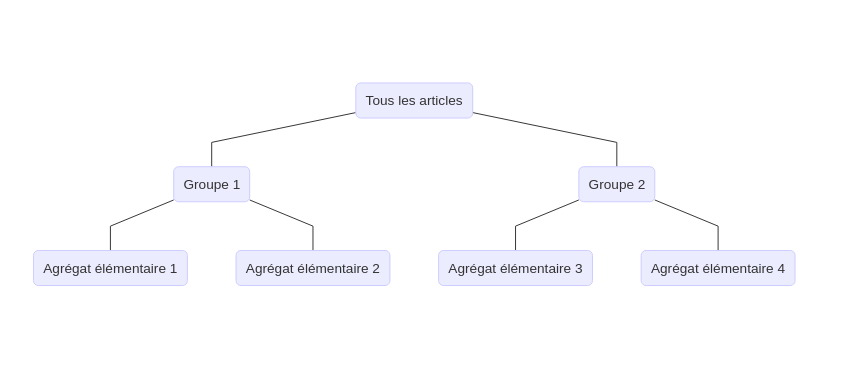
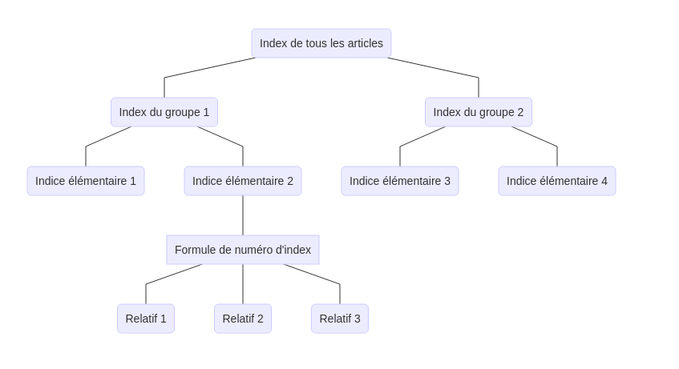

# (PART) Introduction aux indices de prix{-}

# Programme pour Introduction aux indices de prix

Un indice des prix permet de condenser systématiquement les informations sur de nombreux prix pour une gamme de produits et services en une seule valeur. Les indices des prix sont largement utilisés pour analyser et comparer les conditions macroéconomiques dans le temps et ont des implications importantes pour les politiques gouvernementales.

L'objectif de ce module est de fournir une introduction aux indices de prix, avec une application aux indices de prix des entrées et sorties de production (indice des prix à la production), et des prix à la consommation (indice des prix à la consommation). À la fin du module, une personne devrait:

1. Comprendre les raisons pour lesquelles les indices de prix sont compilés et pourquoi ils sont importants.

2. Familiarisez-vous avec les formules d'index communes et comment les manipuler.

3. Avoir une compréhension de base de la structure d'un indice de prix et de son calcul.

Ce module est utile à la fois pour les utilisateurs et les compilateurs d'indices de prix ayant peu de connaissances préalables sur les utilisations et la construction d'un indice de prix.

Ce module se compose de lectures autodirigées, accompagnées d'un devoir. Au total, environ 10 à 15 heures devraient être consacrées à ce module

Il n'y a pas de prérequis pour ce module, bien que les individus devraient être à l'aise avec l'algèbre de base et les arguments mathématiques simples. Un cours d'introduction à la macroéconomie est utile.

L'évaluation de ce module est basée sur une tâche composée de 20 questions à choix multiples / vrai-faux qui s'appuient sur du matériel dans le contenu du cours et les lectures. La collaboration sur la mission est la bienvenue, mais chaque personne doit soumettre son propre travail unique. La réussite de ce module nécessite au moins 65% sur l'affectation.

Les lectures de ce module proviennent des chapitres 1, 2, 4 et 9 du Manuel de l'indice des prix à la production [@ppimanual] et / ou du Manuel de l'indice des prix à la consommation [@cpimanual], publiés par le FMI (disponibles gratuitement sur leur site Web). Comme il existe un chevauchement considérable entre ces sources, le manuel PPI est utilisé comme référence principale.

Veuillez envoyer un e-mail à l'instructeurs du cours ([Steve Martin](mailto:steve.martin5@canada.ca) ou [Shaoxiong Wang](mailto:shaoxiong.wang@canada.ca) ou [Anastasiia Nosach](mailto:anastasiia.nosach@canada.ca)) si vous avez des questions ou si vous avez besoin d'aide concernant le matériel ou le devoir du cours.

# Qu'est-ce qu'un indice des prix et pourquoi en avons-nous besoin?

Un indice des prix est un outil pour mesurer l'évolution du prix des biens et services au fil du temps. Les indices des prix ont une longue histoire et constituent une statistique macroéconomique importante et largement utilisée. Cette section du cours commence par présenter ce qu'est un indice des prix, à quoi ils servent et pourquoi un indice des prix est nécessaire.

&#128214; Manuel PPI: Chapitre 1, sections A, K; Chapitre 2, sections A, B, D1, D2, E, F.

&#128214; Manuel de l'IPC: chapitre 1, paragraphes 1.8 à 1.12; Chapitre 2.

## Qu'est-ce qu'un indice des prix?

Un indice de prix est une série chronologique économique qui donne la variation en pourcentage des prix d'une collection de biens et services entre un moment donné et un point de référence fixe (c'est-à-dire la période de base ou la période de référence).^[Un prix l'indice peut également être utilisé pour mesurer la différence de prix à différents endroits au même moment, bien qu'il s'agisse d'une utilisation moins courante d'un indice de prix.] Un indice de prix est généralement représenté de manière à soustraire 100 de la valeur de l'indice donne la variation en pourcentage des prix des biens et services capturés par l'indice. Par exemple, si un indice des prix des widgets a une valeur de 110 pendant une certaine période, alors les prix des widgets ont augmenté de 10% depuis la période de base. Cette représentation signifie également que l'indice a une valeur de 100 dans la période de base.

Le graphique ci-dessous donne un exemple d'indice de prix mensuel montrant la variation des prix de chaque mois de l'année par rapport à janvier (la période de base), de sorte que chaque point du graphique donne la variation en pourcentage des prix depuis janvier. Par exemple, en mars, l'indice avait une valeur de 103, ce qui signifie que les prix ont augmenté de 3% entre mars et janvier, tandis que l'indice avait une valeur de 99 en juin, ce qui signifie que les prix ont diminué de 1% entre janvier et juin.

```{r, echo=FALSE}
library(ggplot2)
ggplot() +
  geom_line(aes(seq(as.Date("2020-01-01"), as.Date("2020-12-01"), "month"),
                c(100, 102, 103, 101, 99.5, 99, 100.5, 101, 101.5, 100, 102, 105))) +
  labs(x = "Mois", y = "Valeur", title = "Exemple d'indice de prix") +
  theme_classic() +
  lims(y = c(98, 106)) +
  scale_x_date(date_labels = "%b")
```

Étant donné qu'un indice des prix ne mesure que la variation relative des prix depuis la période de base, le changement d'échelle de l'indice ne modifie pas son contenu économique. Par exemple, la division de 100 de toutes les valeurs du graphique ci-dessus ne modifie pas la forme du graphique ou la variation en pourcentage de la valeur d'index qui en résulte depuis la période de base. C'est pour cette raison que l'ampleur d'un indice des prix ne donne pas une mesure du niveau des prix à un moment donné - un indice des prix ne peut que mesurer la variation des prix au fil du temps.

L'utilité d'un indice des prix est qu'il permet de condenser systématiquement les informations sur de nombreux prix pour une gamme de biens et services en une seule valeur qui mesure l'évolution des prix de ces biens et services au fil du temps. Bien que les biens et services qui entrent dans la portée d'un indice des prix dépendent de son objet, tous les indices des prix donnent une mesure des mouvements de prix agrégés pour un ensemble bien défini de produits. Cela donne à son tour une mesure des pressions inflationnistes dans une économie et, par conséquent, les indices des prix sont omniprésents lors de l'examen des conditions et des politiques macroéconomiques.

## Utilisations d'un indice des prix

Dans la pratique, il existe deux grandes catégories dans lesquelles les indices des prix publiés par les organismes statistiques nationaux entrent dans la catégorie: les indices des prix à la consommation (IPC) et les indices des prix à la production (IPP). Comme leur nom l'indique, les IPC sont axés sur la mesure des variations de prix des biens et services achetés par les consommateurs (consommation finale), tandis que les IPP se concentrent sur la mesure des prix facturés par les producteurs pour les biens et services produits et les prix payés pour les intrants dans la production. Malgré les nombreuses subtilités sur ce qui constitue un consommateur et ce qui constitue un producteur, les IPC et les IPP cherchent à mesurer la variation des prix au fil du temps pour les biens et services qui sont négociés dans une économie. Par conséquent, il y a souvent
chevauchement considérable dans la façon dont les IPC et les IPP sont calculés et utilisés, et il n'est pas nécessaire de faire la distinction entre un indice comme un IPC ou un IPP --- il suffit souvent de parler d'un indice général des prix.

L'utilisation la plus importante d'un indice des prix, qu'il s'agisse d'un IPC ou d'un IPP, est probablement de mesurer l'inflation - le changement systématique des prix dans une économie au fil du temps. Au-delà d'être un indicateur macroéconomique important, la mesure de l'inflation affecte directement de nombreuses interactions économiques dans les économies modernes. Par exemple, de nombreuses banques centrales opèrent dans un régime de ciblage de l'inflation, selon lequel la politique monétaire est menée en partie pour maintenir le taux d'inflation dans une fourchette prédéterminée (par exemple, 1% à 3% par an). Ce régime politique nécessite une mesure fréquente et opportune de l'inflation, et l'instrument utilisé pour mesurer l'inflation peut avoir un impact direct sur la politique monétaire et, par conséquent, sur les taux d'intérêt. L'inflation affecte également les salaires et les contrats de services, les paiements de pension et les prestations de sécurité sociale, car ces contrats sont souvent indexés sur l'inflation --- si les prix augmentent de 2% par an, les salaires augmentent également de 2% par an. L'indexation préserve la valeur des paiements au fil du temps sans avoir à constamment renégocier les contrats ou repenser les politiques. La mesure de l'inflation a donc des implications importantes sur le revenu des ménages et les revenus de l'industrie.

Au-delà de la mesure de l'inflation, l'une des principales utilisations des indices de prix pour les organismes statistiques nationaux est de déflater les valeurs agrégées dans un cadre de comptabilité nationale pour obtenir une mesure de l'évolution de la production de biens et services réels au fil du temps. Cela équivaut à trouver un indice de quantité pour condenser systématiquement les informations sur de nombreuses sorties pour une gamme de biens et services en une seule valeur qui mesure la variation de la quantité de biens et services produits au fil du temps. Bien qu'il existe de nombreux détails, la justification de la déflation des valeurs agrégées pour obtenir une mesure de la production réelle est assez simple. Si $V_1 / V_0$ est le rapport entre la valeur de la production de la période 1 et la valeur de la production de la période 0, et si cela peut être décomposé en un indice de quantité $Q$ et un indice de prix $I$ tels que $V_1 / V_0 = IQ$, alors la variation de la production réelle entre la période 0 et la période 1 est simplement $Q = V_1 / (V_0 I)$. L'évolution de la valeur de la production au fil du temps - une quantité connue - peut être transformée en une mesure de l'évolution de la production réelle en la déflatant simplement avec un indice des prix.

## Pourquoi un indice des prix?

Le point de départ pour comprendre l'utilité d'un indice des prix est de reconnaître qu'il n'y en a pas besoin si l'objectif est de comparer le prix d'un seul bien ou service au cours d'une période au prix du même bien ou service au cours d'une autre période. Si $p_1$ est le prix d'un bien pendant la période 1 et $p_0$ est le prix de ce même bien pendant la période 0, alors le prix relatif $p_1 / p_0$ donne sans ambiguïté la variation en pourcentage du prix entre la période 1 et la période 0 La nécessité d'un indice des prix découle d'un problème fondamental de comparaison d'une collecte de deux prix ou plus à deux moments pour arriver à une variation globale des prix.

Pour illustrer ce problème de comparaison, supposons qu'il existe deux biens, notés $i$ et $j$, qui se vendent dans les périodes 0 et 1. Si le prix du bon $i$ et le prix du bon $j$ augmentent tous les deux entre les périodes 0 et la période 1, il n'est donc pas contesté de dire que les prix ont augmenté entre la période 0 et la période 1 (même si la quantité de prix a augmenté moins clairement). De même, si les deux prix baissent, il est naturel de dire que les prix ont baissé. Cependant, un problème se pose si le prix du bon $i$ augmente entre la période 0 et
période 1 tandis que le prix du bon $j$ diminue. Dans ce cas, il n'est pas clair si les prix ont augmenté ou diminué --- il n'y a pas de moyen évident de donner une direction unique à l'évolution des prix au fil du temps.

Une solution à ce problème de comparaison consiste à trouver un moyen d'agréger les prix relatifs pour de nombreux biens et services pour former un ratio unique, qui est ensuite interprété comme l'évolution globale des prix au fil du temps. C'est le travail d'un indice des prix. Bien qu'un indice des prix résout le problème de la comparaison, il introduit un nouveau défi: comment combiner au mieux les prix relatifs pour produire une mesure unique décrivant la variation globale des prix. Par conséquent, diverses formules d'indice-nombre ont été proposées pour construire un indice de prix.

# Formule de numéro d'index

Il existe un grand nombre de formules d'indices qui peuvent être utilisées pour combiner des informations sur les prix à deux moments dans le temps pour produire un indice des prix, malgré l'objectif commun de mesurer les variations de prix au fil du temps. Cette section du cours couvre 10 formules d'indice-nombre importantes qui sont utilisées dans la pratique pour calculer un indice de prix. Le nom de la personne qui l'a développée est associé à chaque formule. Il est important d'associer les noms aux formules, car ils sont généralement désignés par leur nom dans l'application. Il s'agit malheureusement d'un exercice de mémorisation, car la plupart des formules d'index ont une forme similaire.

Pour aider à construire l'intuition et une compréhension plus approfondie de ce que font les formules de l'indice-nombre, ces différentes approches pour calculer un indice de prix peuvent être classées en gros comme des indices de prix arithmétiques ou des indices de prix géométriques. Toutes les formules de nombre d'index ne tombent pas dans ces deux groupes --- par exemple, il existe également des indices de prix harmoniques, une catégorie qui peut chevaucher des indices arithmétiques --- mais les indices arithmétiques et géométriques sont assez faciles à comprendre, avec la plupart des indices- formules de nombres entrant dans l'une de ces deux catégories.

En pratique, un indice de prix est multiplié par 100, de sorte que le changement en pourcentage de la valeur de l'indice sur deux périodes est simplement la valeur de l'indice moins 100. Il s'agit simplement d'une normalisation pratique qui n'a aucune incidence sur le contenu économique d'un indice de prix, et est ignoré dans cette section. Notez que toutes les formules d'index peuvent être multipliées par 100 pour les mettre sur l'échelle habituelle.

&#128214; Manuel PPI: Chapitre 1, sections B1 - B3.

## Indices arithmétiques des prix

Un indice arithmétique des prix prend les prix relatifs pour une collection de biens et services sur deux périodes et les combine ensemble comme moyenne pondérée. Autrement dit, un indice arithmétique est simplement la variation moyenne du prix entre deux points dans le temps. Laissant les marchandises être énumérées par $i = 1, \ldots, n$, un index arithmétique entre la période 0 et la période 1 a la forme générale^[La lettre majuscule sigma $\Sigma$ est l'opérateur de sommation. Pour une collection de nombres $x_{1}, x_{2}, \ldots, x_{n}$, $\sum_{i = 1}^{n} x_{i}$ signifie $x_{1} + x_{2} + \ldots + x_{n}$.]

\begin{align*}
I^{A} = \sum_{i = 1}^{n} \omega_{i} \frac{p_{i1}}{p_{i0}},
\end{align*}

où $p_{it}$ est le prix du bon $i$ dans la période $t = 0,1$, et $\omega_{i} \geq 0$ est le poids que le bon $i$ reçoit dans le calcul de l'indice, tel que $\sum_{i = 1}^{n} \omega_{i} = 1$.

Différents indices de prix arithmétiques correspondent à des cas particuliers de l'indice arithmétique général, selon le choix des pondérations. La plupart de ces choix utilisent des informations sur la quantité d'un bien vendu, de sorte que les poids donnent une mesure de l'importance économique d'un bien. Notons $q_{it}$ la quantité de bon $i$ consommée / produite dans la période $t = 0,1$.

Avant d'examiner des indices arithmétiques spécifiques, il convient de noter qu'un indice arithmétique peut toujours être écrit comme le rapport des dépenses / recettes pour un "panier" de biens et services à deux points dans le temps, de sorte que pour tout ensemble de pondérations, il est implicite "quantités" telles que

\begin{align*}
I^{A} = \frac{\sum_{i = 1}^{n} p_{i1} \tilde{q}_{i}}{\sum_{i = 1}^{n} p_{i0} \tilde{q}_{i}},
\end{align*}

où $\tilde{q}_{i} = \alpha \omega_{i} / p_{i0}$ pour un certain facteur de proportionnalité $\alpha$.^[La valeur de $\alpha$ n'a aucun impact sur l'indice, mais est nécessaire pour que la propriété interprète $\tilde{q}_{i}$ comme une quantité. Par exemple, si $\omega_{i}$ est la part des dépenses de la période 0 sur les bons $i$, $p_{i0} q_{i0} / \sum_{j = 1}^{n} p_{j0} q_{j0}$, puis $\alpha = \sum_{j = 1}^{n} p_{j0} q_{j0}$ pour que $\tilde{q}_{i} = q_{i0}$.] Ainsi, un indice arithmétique peut toujours être interprété comme le rapport des dépenses nécessaires à l'achat d'un panier fixe de biens à deux moments (ou les revenus d'un panier fixe de biens à deux moments). Le choix du panier est lié un à un au choix des pondérations utilisées pour agréger les prix relatifs. Les deux représentations de l'indice arithmétique sont utilisées, car certains indices sont plus faciles à représenter sous une forme que l'autre.

## Indices arithmétiques communs

Il existe six principaux indices de prix arithmétiques qui sont utilisés dans la pratique, chacun correspondant à une déclaration différente sur le poids qu'un prix relatif devrait recevoir dans le calcul de l'indice.

**Indice Carli**. La définition de $\omega_{i} = 1 / n$ entraîne l'index Carli

\begin{align*}
I^{A}_{C} = \frac{1}{n} \sum_{i = 1}^{n} \frac{p_{i1}}{p_{i0}}.
\end{align*}

L'indice Carli adopte une position neutre sur les pondérations et considère chaque prix relatif comme tout aussi important.

**Indice de Dutot**. La définition de $\omega_{i} = p_{i0} / \sum_{j = 1}^{n} p_{j0}$ entraîne l'index Dutot

\begin{align*}
I^{A}_D = \frac{\sum_{i = 1}^{n} p_{i1}}{\sum_{i = 1}^{n} p_{i0}}.
\end{align*}

L'indice Dutot donne plus de poids aux prix apparentés qui ont un prix supérieur à la période 0, en comparant le prix moyen des biens de la période 1 au prix moyen de la période 0.

**Indice Lowe**. La définition de $\omega_{i} = p_{i0} q_{ib} / \sum_{j = 1}^{n} p_{j0} q_{jb}$ entraîne l'index Lowe

\begin{align*}
I^{A}_{l} = \frac{\sum_{i = 1}^{n} p_{i1} q_{ib}}{\sum_{i = 1}^{n} p_{i0} q_{ib}},
\end{align*}

où $q_{ib}$ est la quantité de bons $i$ au cours d'une période de base $b$, généralement avant la période 0. Les pondérations de l'indice de Lowe sont des parts de dépenses / revenus "hybrides" pour le panier de biens et services dans la période $b$ en utilisant les prix de la période 0.

**Indice de Laspeyres**. La définition de $\omega_{i} = p_{i0} q_{i0} / \sum_{j = 1}^{n} p_{j0} q_{j0}$ entraîne l'index de Laspeyres

\begin{align*}
I^{A}_{L} = \frac{\sum_{i = 1}^{n} p_{i1} q_{i0}}{\sum_{i = 1}^{n} p_{i0} q_{i0}}.
\end{align*}

L'indice de Laspeyres pondère les prix relatifs en fonction de leur part des dépenses / recettes pour la période 0, et constitue un cas particulier de l'indice de Lowe.

**Indice de Paasche**. La définition de $\omega_{i} = p_{i0} q_{i1} / \sum_{j = 1}^{n} p_{j0} q_{j1}$ entraîne l'index de Paasche

\begin{align*}
I^{A}_{P} = \frac{\sum_{i = 1}^{n} p_{i1} q_{i1}}{\sum_{i = 1}^{n} p_{i0} q_{i1}}.
\end{align*}

Comme l'indice Laspeyres, l'indice Paasche est un cas particulier de l'indice Lowe et utilise des parts hybrides dépenses / recettes pour pondérer les prix relatifs.

Il convient de noter que l’indice de Paasche est souvent calculé comme une moyenne harmonique pondérée, avec des parts de dépenses / recettes de la période 1 comme pondérations, de sorte que

\begin{align*}
I^{A}_{P} = \left (\sum_{i = 1}^{n} \frac{\frac{p_{i1} q_{i1}}{\sum_{j = 1}^{n} p_{j1} q_{j1}}}{\frac{p_{i1}}{p_{i0}}} \right)^{- 1}.
\end{align*}

Il s'agit d'un exemple d'indice de prix harmonique et d'un moyen pratique de calculer un indice de Paasche si seules les parts des dépenses / recettes de la période 1 sont connues, plutôt que les quantités de la période 1.

**Indice Young**. La définition de $\omega_{i} = p_{ib} q_{ib} / \sum_{j = 1}^{n} p_{jb} q_{jb}$ entraîne l'index Young

\begin{align*}
I^{A}_{Y} = \sum_{i = 1}^{n} \frac{p_{ib} q_{ib}}{\sum_{j = 1}^{n} p_{jb} q_{jb}} \frac{p_{i1}}{p_{i0}},
\end{align*}

où $ q_{ib}$ est la quantité de bon $i$ dans une période de base $b$, avec $ p_{ib}$ comme prix, généralement avant la période 0. L'indice Young utilise la période $b$ dépenses / parts de revenus sous forme de pondérations.^[Dans certains cas, un indice de Young est utilisé pour faire référence à un indice arithmétique général, plutôt qu'à un indice arithmétique avec un ensemble particulier de pondérations.] L'indice Laspeyres est un cas particulier de l'indice Young.

Dans la plupart des applications, un indice de Laspeyres est la formule d'indice-nombre souhaitée pour un indice de prix arithmétique, en partie parce que les pondérations peuvent être observées séparément des informations sur les prix. Les pondérations pour un IPC, par exemple, peuvent provenir d'une enquête nationale représentative des dépenses des ménages, et donc seules les informations sur les prix doivent être collectées pour calculer un indice de Laspeyres. Bien que les pondérations de Young soient également directement observables, elles ne reflètent pas nécessairement les changements dans la composition des dépenses ou des sources de revenus entre la période $b$ et la période 0. Alternativement, les indices Lowe et Paasche ont tous deux des pondérations qui doivent être explicitement calculées . Comme l'indice Young, l'indice Lowe utilise des informations de quantité obsolètes, tandis que l'indice Paasche utilise des informations de quantité de la période actuelle, ce qui signifie généralement qu'il ne peut pas être calculé en temps opportun.

Malgré l'objectif de calculer un indice de Laspeyres, dans la plupart des applications, un indice arithmétique est souvent calculé comme un indice de Young (ou parfois un indice de Lowe), car il est difficile d'obtenir des informations en temps opportun sur le partage des dépenses / recettes. L'attente des informations de pondération peut nécessiter de retarder la production d'un indice bien après la période 0. L'espoir est que les pondérations utilisées dans l'indice de Young offrent une approximation raisonnable des pondérations de Laspeyres.

## Indices arithmétiques moins courants

Il existe une variété d'indices arithmétiques qui sont rarement utilisés dans la pratique, mais peuvent être utiles à connaître. Comme ces formules d'index sont rarement utilisées, ce matériau peut être sauté en toute sécurité.

**Indice de Palgrave**. La définition de $\omega_{i} = p_{i1} q_{i1} / \sum_{j = 1}^{n} p_{j1} q_{j1}$ entraîne l'index Palgrave

\begin{align*}
I^{A}_{p} = \sum_{i = 1}^{n} \frac{p_{i1} q_{i1}}{\sum_{j = 1}^{n} p_{j1} q_{j1}} \frac{p_{i1}}{p_{i0}}.
\end{align*}

L'indice Palgrave utilise les parts de dépenses de la période 1 comme pondérations et constitue un cas particulier de l'indice Young.

**Index sans nom**. Réglage

\begin{align*}
\omega_{i} = \frac{1}{2} \frac{p_{i0} q_{i0}}{\sum_{j = 1}^{n} p_{j0} q_{j0}} + \frac{1}{2} \frac{p_{i1} q_{i1}}{\sum_{j = 1}^{n} p_{j1} q_{j1}}
\end{align*}

donne une formule de numéro d'index sans nom,

\begin{align*}
I^{A}_{U} = \sum_{i = 1}^{n} \left(\frac{1}{2} \frac{p_{i0} q_{i0}}{\sum_{j = 1}^{n} p_{j0} q_{j0}} + \frac{1}{2} \frac{p_{i1} q_{i1}}{\sum_{j = 1}^{n} p_{j1} q_{j1}} \right) \frac{p_{i1}}{p_{i0}}.
\end{align*}

Cet indice est un mélange des indices Laspeyres et Palgrave, les pondérations étant données par la part moyenne des dépenses / recettes entre la période 0 et la période 1.

**Indice Drobisch**. Réglage

\begin{align*}
\omega_{i} = \frac{1}{2} \frac{p_{i0} q_{i0}}{\sum_{j = 1}^{n} p_{j0} q_{j0}} + \frac{1}{2} \frac{p_{i0} q_{i1}}{\sum_{j = 1}^{n} p_{j0} q_{j1}}
\end{align*}

résultats dans l'indice Drobisch

\begin{align*}
I^{A}_{d} = \frac{1}{2} \frac{\sum_{i = 1}^{n} p_{i1} q_{i0}}{\sum_{i = 1}^{n} p_{i0} q_{i0}} + \frac{1}{2} \frac{\sum_{i = 1}^{n} p_{i1} q_{i1}}{\sum_{i = 1}^{n} p_{i0} q_{i1}}.
\end{align*}

Cet indice est un mélange des indices Laspeyres et Paasche.

**Indice de Walsh**. Définition de $\omega_{i} = p_{i0} \sqrt{q_{i0} q_{i1}} / \sum_{j = 1}^{n} p_{j0} \sqrt{q_{j0} q_{j1}}$ entraîne l'index de Walsh

\begin{align*}
I^{A}_{W} = \frac{\sum_{i = 1}^{n} p_{i1} \sqrt{q_{i0} q_{i1}}}{\sum_{i = 1}^{n} p_{i0} \sqrt{q_{i0} q_{i1}}}.
\end{align*}

Cet indice utilise un panier qui contient la moyenne géométrique des quantités de la période 0 et de la période 1.

**Indice Marshall-Edgeworth**. Définition de $\omega_{i} = p_{i0} (q_{i0} + q_{i1}) / \sum_{j = 1}^{n} p_{j0} (q_{j0} + q_{j1})$ résulte dans l'indice Marshall-Edgeworth

\begin{align*}
I^{A}_{M} = \frac{\sum_{i = 1}^{n} p_{i1} (q_{i0} + q_{i1}) / 2}{\sum_{i = 1}^{n} p_{i0} (q_{i0} + q_{i1}) / 2}.
\end{align*}

Comme l'indice de Walsh, cet indice utilise un panier qui prend une moyenne des quantités de la période 0 et de la période 1.

**Indice Geary-Khamis**. Paramètre $\omega_{i} = p_{i0} / (1 / q_{i0} + 1 / q_{i1}) / \sum_{j = 1}^{n} p_{j0} / (1 / q_{j0} + 1 / q_{j1})$ se traduit par l'indice Geary-Khamis

\begin{align*}
I^{A}_{G} = \frac{\sum_{i = 1}^{n} 2 p_{i1} / (1 / q_{i0} + 1 / q_{i1})}{\sum_{i = 1}^{n} 2 p_{i0} / (1 / q_{i0} + 1 / q_{i1})}.
\end{align*}

Comme les indices Walsh et Marshall-Edgeworth, cet indice utilise un panier qui prend en moyenne les quantités de la période 0 et de la période 1.

## Indices géométriques des prix

Un indice de prix géométrique est entièrement analogue à un indice arithmétique, sauf que les prix relatifs sont agrégés avec une moyenne géométrique au lieu d'une moyenne arithmétique. Autrement dit, un indice géométrique général des prix est donné par^[La lettre majuscule pi $\Pi$ est l'opérateur du produit. Pour une collection de nombres $x_{1}, x_{2}, \ldots, x_{n}$, $\prod_{i = 1}^{n} x_{i}$ signifie $x_{1} \times x_{2} \times \ldots \times x_{n}$.]

\begin{align*}
I^{G} = \prod_{i = 1}^{n} \left(\frac{p_{i1}}{p_{i0}} \right)^{\omega_{i}}.
\end{align*}

Comme pour les indices arithmétiques, différents indices géométriques correspondent à différents choix pour les poids.^[Il est intéressant de noter que les poids peuvent également être choisis de sorte que tout indice géométrique soit également un indice arithmétique (et vice versa). Autrement dit, pour tout $\omega_{i}$, il existe un $\tilde{\omega}_{i}$ tel que $\prod_{i = 1}^{n} (p_{i1} / p_{i0})^{\omega_{i}} = \sum_{i = 1}^{n} \tilde{\omega}_{i} p_{i1} / p_{i0}$. Voir @balk2008[Section 4.2] pour voir à quoi ressemblent ces poids. Cadrer un index comme arithmétique ou géométrique est vraiment juste un cas de cadrage des poids.]

**Indice de Jevons**. La définition de $\omega_{i} = 1 / n$ entraîne l'index Jevons

\begin{align*}
I^{G}_{J} = \prod_{i = 1}^{n} \left(\frac{p_{i1}}{p_{i0}} \right)^{1 / n},
\end{align*}

ou équivalent,

\begin{align*}
I^{G}_{J} = \frac{\prod_{i = 1}^{n} p_{i1}^{1 / n}}{\prod_{i = 1}^{n} p_{i0}^{1 / n}}.
\end{align*}

L'indice de Jevons est l'analogue géométrique de l'indice de Carli ou Dutot.

**Indice géométrique de Laspeyres**. La définition de $\omega_{i} = p_{i0} q_{i0} / \sum_{j = 1}^{n} p_{j0} q_{j0}$ entraîne l'index géométrique de Laspeyres

\begin{align*}
I^{G}_{L} = \prod_{i = 1}^{n} \left(\frac{p_{i1}}{p_{i0}} \right)^{\frac{p_{i0} q_{i0}}{\sum_{j = 1}^{n} p_{j0} q_{j0}}}.
\end{align*}

Similaire à l'indice de Jevons, il s'agit de l'analogue géométrique de l'indice de Laspeyres. Il est également trivial de définir un indice géométrique de Young en utilisant la part des dépenses / recettes de la période-$b$ plutôt que celle de la période 0.^[La définition d'un indice géométrique de Lowe est moins évidente. Par exemple, l'indice géométrique de Paasche utilise les parts des dépenses / recettes de la période 1 comme pondérations, au lieu des pondérations hybrides utilisées pour l'indice arithmétique de Paasche. Peut-être un meilleur nom pour cet index serait l'indice de Palgrave géométrique.]

**Indice de Törnqvist**. Réglage

\begin{align*}
\omega_{i} = \frac{1}{2} \frac{p_{i0} q_{i0}}{\sum_{j = 1}^{n} p_{j0} q_{j0}} + \frac{1}{2} \frac{p_{i1} q_{i1}}{\sum_{j = 1}^{n} p_{j1} q_{j1}}
\end{align*}

résulte en l'indice de Törnqvist, qui est généralement exprimé en

\begin{align*}
\log(I^{G}_{T}) = \sum_{i = 1}^{n} \left(\frac{1}{2} \frac{p_{i0} q_{i0}}{\sum_{j = 1}^{n} p_{j0} q_{j0}} + \frac{1}{2} \frac{p_{i1} q_{i1}}{\sum_{j = 1}^{n} p_{j1} q_{j1}} \right) \log\left(\frac{p_{i1}}{p_{i0}} \right).
\end{align*}

L'indice de Törnqvist développe l'indice géométrique de Laspeyres en utilisant les parts de dépenses à la fois pour la période 0 et la période 1 pour former des pondérations (c'est-à-dire la part des dépenses moyennes entre la période 0 et la période 1).

L'indice de Jevons est généralement synonyme d'index géométrique, et il trouve application dans des situations où il n'y a pas d'informations de quantité pour former des poids (par opposition à l'utilisation d'un index Carli ou Dutot). Parfois, un indice de Jevons pondéré est utilisé comme raccourci pour l'indice géométrique général.

Un point à noter à propos des indices géométriques est qu'ils sont toujours plus petits que leurs homologues arithmétiques. Pour tout poids donné, on peut montrer que $I^{G} \leq I^{A}$, avec égalité uniquement lorsque tous les prix relatifs sont égaux ou tous les prix relatifs sauf un ont un poids nul. Par conséquent, un indice géométrique montre toujours une augmentation des prix plus faible dans le temps (ou une diminution plus importante) que l'indice arithmétique correspondant.^[La différence entre un indice arithmétique et un indice géométrique a tendance à être plus grande lorsque les prix relatifs sont plus dispersés, bien que cela n'est pas toujours le cas. Il est possible que la différence devienne plus grande lorsque la variance entre les prix relatifs devient plus petite --- voir @lord2002.] C'est un inconvénient important d'avoir un menu de nombres d'index parmi lesquels choisir, car le choix de la formule de nombre d'index a un impact sur la mesure de l'inflation qui en résulte.^[Le même raisonnement peut être utilisé pour montrer qu'un indice de prix harmonique est toujours plus petit que l'indice géométrique correspondant --- voir @bullen2003 [II 2.1 Corollaire 2].]

## L'indice Fisher

Un indice de prix important qui n'est ni un indice géométrique ni un indice arithmétique est l'indice Fisher, qui est la moyenne géométrique de l'indice Laspeyres (arithmétique) et de l'indice Paasche (arithmétique),

\begin{align*}
I_{F} &= \sqrt{\frac{\sum_{i = 1}^{n} p_{i1} q_{i0}}{\sum_{i = 1}^{n} p_{i0} q_{i0}} \times \frac{\sum_{i = 1}^{n} p_{i1} q_{i1}}{\sum_{i = 1}^{n} p_{i0} q_{i1}}} \\
&= \sqrt{I^{A}_{L} \times I^{A}_{P}}.
\end{align*}

L'indice Fisher est souvent considéré comme un indice idéal car il traite symétriquement les informations de la période 0 et de la période 1.^[L'indice Törnqvist est également considéré comme idéal pour une raison similaire, et ces types d'indices sont souvent appelés superlatifs.] En pratique cependant, l'indice de Fisher n'est pas fréquemment utilisé par les organismes statistiques nationaux car il n'est pas opportun de le calculer. En effet, cela dépend de l'indice de Paasche, qui nécessite des informations sur les quantités de la période 1 en plus des prix de la période 1, ce qui a été historiquement impossible à collecter pour les organismes statistiques nationaux.

## Exemple avec R: formules d'index

Toutes les formules de l'indice-nombre présentées dans cette section sont simplement des moyennes pondérées et sont assez faciles à calculer dans R étant donné les informations sur les prix et certains poids.

```{r}
# Apportez dans la bibliothèque gpindex
library(gpindex) # install.packages("gpindex")

# Faites des prix apparentés
relatives <- c(1.1, 1.2, 0.9, 1.1)

# Faites des poids
weights <- c (0.25, 0.3, 0.3, 0.15)

# Calculer les indices
c(Carli = mean_arithmetic(relatives),
  Jevons = mean_geometric(relatives),
  Arithmétique = mean_arithmetic(relatives, weights),
  Géométrique = mean_geometric(relatives, weights))
```

Le type d'indices arithmétiques et géométriques que cela calcule dépend entièrement de la façon dont les poids sont calculés. Habituellement, les pondérations proviennent des données sur les parts des dépenses / recettes, et la manière dont ces informations sont utilisées pour pondérer les prix relatifs affectera le type d'indice de prix calculé.

```{r}
# Part des dépenses / recettes de la période de base
share0 <- c (0.25, 0.3, 0.3, 0.15)

# Part des dépenses / recettes de la période en cours
share1 <- c (0.2, 0.2, 0.4, 0.2)

# Calculer les indices
c(Laspeyres = mean_arithmetic(relatives, share0),
  Paasche = mean_harmonic(relatives, share1),
  Fisher = sqrt(mean_arithmetic(relatives, share0) * 
                  mean_harmonic(relatives, share1)),
  `Géométrique Laspeyres` = mean_geometric(relatives, share0),
  `Géométrique Paasche` = mean_geometric(relatives, share1),
  Tornqvist = mean_geometric(relatives, (share0 + share1) / 2))
```

Il est intéressant de noter que tout indice géométrique peut être transformé en indice arithmétique par un changement approprié de poids. Cela permet de déterminer facilement la contribution de chaque prix relatif à la valeur de l'indice.

```{r}
# Tornqvist index
mean_geometric(relatives, (share0 + share1) / 2) 

# Changer les poids
new_weights <- weights_transmute(0, 1)(relatives, (share0 + share1) / 2)
mean_arithmetic(relatives, new_weights) # same as geometric mean

# Contribution de chaque relative
(relatives - 1) * new_weights
```

# Calcul d'un indice des prix

N'importe laquelle des formules de numéro d'index de la section précédente peut être utilisée pour créer un indice de prix qui mesure la variation de prix pour une seule collection de biens et services sur deux périodes. Dans l'application, cependant, les indices de prix sont calculés pour une variété de biens et services différents, et sont calculés sur de nombreuses périodes, pas seulement deux. Ces deux points ont des implications sur la façon dont les formules de l'indice-nombre dans la section précédente sont utilisées pour calculer un indice de prix dans la pratique. Cette section du cours explore comment les formules d'indice à deux périodes de la section précédente peuvent être utilisées pour calculer un indice de prix pour plusieurs groupes de biens et services sur plusieurs périodes.

&#128214; Manuel PPI: Chapitre 4, section D; Chapitre 9, paragraphes 9.6 à 9.24 et sections B3, B4, C1 à C7.2.

&#128214; Manuel de l'IPC: chapitre 1, paragraphes 1.147 à 1.164; Chapitre 4, paragraphes 4.16--4.33.

## Sous-indices et agrégation

La plupart des indices des prix ont une structure hiérarchique (ou agrégée), de sorte que les biens et services sont divisés en groupes ou catégories de plus en plus larges qui s'étendent à tous les biens et services couverts par l'indice des prix. Par exemple, les marchandises d'un IPC peuvent être divisées en grandes catégories telles que la nourriture, le logement, le transport, etc. Ces catégories sont ensuite divisées en catégories plus petites; les aliments peuvent être divisés en viande, journal intime, volaille, etc. Ce type de structure présente l'avantage évident de fournir un indice de prix pour les sous-catégories de biens et services qui présentent souvent un intérêt à part entière (bien qu'il existe d'autres, plus raisons subtiles de vouloir structurer un indice de prix comme celui-ci). Le graphique ci-dessous donne un exemple d'une structure d'agrégation simple à trois niveaux.



```{r, eval=FALSE, echo=FALSE}
library(DiagrammeR)
mermaid("
  graph TD
    A(Tous les articles) --- B(Groupe 1)
    A --- C(Groupe 2)
    B --- B1(Agrégat élémentaire 1)
    B --- B2(Agrégat élémentaire 2)
    C --- C1(Agrégat élémentaire 3)
    C --- C2(Agrégat élémentaire 4)
")
```

Une structure hiérarchique ne pose pas de problème particulier pour créer un indice de prix --- l'une des formules de numéro d'index de la section précédente peut toujours être utilisée pour agréger les prix relatifs des biens et services dans chaque groupe de la hiérarchie à produire une collection d'indices de prix pour chaque niveau de la hiérarchie. Le calcul de l'indice doit simplement être répété pour chaque groupe de biens et services dans la structure d'agrégation. Il s'agit de l'approche directe pour calculer un indice de prix avec une structure hiérarchique.

Cependant, avoir une structure hiérarchique suggère que le calcul peut être simplifié avec une procédure en deux étapes. Dans la première étape, les prix relatifs sont combinés au niveau d'agrégation le plus bas en utilisant l'une des formules de numéro d'index de la section précédente. Cela donne une collection d'indices de prix appelés indices élémentaires (ou élémentaires). Ces indices de prix donnent l'évolution des prix dans le temps pour de petits groupes de biens et services relativement homogènes appelés agrégats élémentaires qui constituent la base d'un indice de prix. Une fois les indices élémentaires calculés, les indices des niveaux d'agrégation supérieurs sont calculés en combinant les indices élémentaires à l'aide de pondérations. Ces pondérations fournissent une mesure de l'importance économique des biens et services dans chaque agrégat élémentaire afin de combiner les indices élémentaires pour former un indice de niveau supérieur. Si l'indice cible est un indice arithmétique, alors les agrégats élémentaires doivent être combinés avec une moyenne arithmétique pondérée; sinon, si un indice géométrique est l'indice cible, une moyenne géométrique pondérée doit être utilisée. Autrement dit, chaque agrégat élémentaire est traité comme un bien unique, les indices élémentaires étant les prix apparentés pour ces produits, et cette information est introduite dans une formule de nombre d'indice pour produire un indice de niveau supérieur.



```{r, eval=FALSE, echo=FALSE}
mermaid("
  graph TD
    A(Index de tous les articles) --- B(Index du groupe 1)
    A --- C(Index du groupe 2)
    B --- B1(Indice élémentaire 1)
    B --- B2(Indice élémentaire 2)
    C --- C1(Indice élémentaire 3)
    C --- C2(Indice élémentaire 4)
    B2 --- D
    D[Formule de numéro d'index] --- E1(Relatif 1)
    D --- E2(Relatif 2)
    D --- E3(Relatif 3)
")
```

Étant donné qu'il existe deux façons de calculer un indice de prix avec une structure hiérarchique, le calcul direct donne-t-il le même résultat que le calcul en deux étapes? La réponse est oui pour un indice arithmétique ou géométrique, à condition que les poids utilisés pour agréger les agrégats élémentaires soient formés en utilisant les poids sous-jacents pour l'indice cible. Par exemple, si l'objectif est de calculer un indice de Laspeyres, le poids d'un agrégat élémentaire devrait être la part des dépenses / revenus pour les biens de cet agrégat élémentaire au cours de la période 0. Comme les indices géométriques et arithmétiques sont calculés en tant que moyennes pondérées, il ne devrait pas être surprenant qu'un indice puisse être calculé en regroupant d'abord les parents de prix, en calculant les moyennes au niveau du groupe, puis en faisant la moyenne des moyennes au niveau du groupe pour former une moyenne globale. Par conséquent, ces indices seraient cohérents dans l'agrégation, bien que toutes les formules de nombre d'indices ne soient pas cohérentes dans l'agrégation. Par exemple, l'indice de Fisher n'est pas cohérent dans l'agrégation, et l'utilisation de la procédure en deux étapes pour le calculer donnera une réponse différente de celle du calcul direct.

Il est facile de montrer que tout indice arithmétique est cohérent en agrégation (le raisonnement pour le cas géométrique est presque identique). Supposons que les marchandises soient partitionnées en $k = 1, \ldots, m$ catégories distinctes et mutuellement exclusives --- c'est-à-dire qu'il y a $m$ agrégats élémentaires. Si la catégorie $k$ contient $n_{k}$ biens, alors l'index arithmétique de cette catégorie est

\begin{align*}
I_{k}^{A} = \sum_{i = 1}^{n_k} \frac{\omega_{ik}}{\sum_{j = 1}^{n_k} \omega_{jk}} \frac{p_{ik1}}{p_{ik0}},
\end{align*}

où $p_{ik1} / p_{ik0}$ est le prix relatif du bien $i$ dans la catégorie $k$ et $\omega_{ik}$ est le poids du bien $i$ dans la catégorie $k$. Ces indices $m$ peuvent maintenant être agrégés ensemble pour former un indice global en prenant une moyenne pondérée de chaque indice, avec des pondérations données par $\omega_{k} = \sum_{j = 1}^{n_k} \omega_{jk}$, de sorte que

\begin{align*}
I^{A} &= \sum_{k = 1}^{m} \omega_k I_{k}^{A} \\
&= \sum_{k = 1}^{m} \omega_k \sum_{i = 1}^{n_k} \frac{\omega_{ik}}{\sum_{j = 1}^{n_k} \omega_{jk}} \frac{p_{ik1}}{p_{ik0}} \\
&= \sum_{k = 1}^{m} \sum_{i = 1}^{n_k} \omega_{ik} \frac{p_{ik1}}{p_{ik0}}.
\end{align*}

Mais c'est exactement la même chose que si l'indice arithmétique avait été calculé en regroupant tous les parents de prix et en calculant directement l'indice, plutôt que de les diviser en groupes et de calculer l'indice en deux étapes.

Un avantage du calcul en deux étapes par rapport au calcul direct est que la formule d'indice utilisée pour calculer les indices élémentaires peut différer de la formule d'indice utilisée à des niveaux d'agrégation plus élevés. Cela peut sembler étrange de vouloir le faire, mais il existe un certain nombre de raisons théoriques et pratiques subtiles pour lesquelles une formule d'indice différente serait utilisée pour les indices élémentaires. Dans la plupart des applications, les indices élémentaires sont calculés à l'aide d'un indice de Jevons, en partie parce que des informations détaillées sur les quantités achetées ou vendues peuvent être difficiles à obtenir à des niveaux d'agrégation très faibles. Des niveaux plus élevés sont ensuite calculés comme un indice arithmétique, généralement un indice de Young ou Lowe.

## Factorisation d'un index

Lorsqu'il est calculé sur plusieurs périodes, un indice des prix donne une mesure de la variation des prix dans le temps par rapport à une période de base fixe. Le calcul d'un indice de prix sur de nombreuses périodes ne pose pas de nouveaux défis --- une fois qu'une période de base est sélectionnée, l'une des formules de nombre d'index dans la section précédente peut être directement appliquée pour produire un indice qui évolue au fil du temps en formant simplement des parents de prix qui calculez toujours la variation du prix par rapport à la période de base. Par exemple, la série d'indices géométriques calculés sur les périodes 0, 1 et 2, avec la période 0 comme période de base, est

\begin{align*}
1, \prod_{i = 1}^{n} \left (\frac{p_{i1}}{p_{i0}} \right)^{\omega_{i}}, \prod_{i = 1}^{n} \left (\frac{p_{i2}}{p_{i0}} \right)^{\omega_{i}}.
\end{align*}

Ainsi, la valeur de l'indice de la période 1 donne la variation des prix entre la période 1 et la période 0, et l'indice de la période 2 donne la variation des prix entre la période 2 et la période 0. La valeur de la période 0 est 1 car le rapport des prix de la période 0 à la période 0 prix est toujours 1.

La plupart des indices de prix sont calculés fréquemment --- généralement mensuellement ou trimestriellement --- et il est utile de pouvoir calculer un indice de prix en utilisant uniquement la valeur d'indice de la période précédente et les prix relatifs les plus récents pour chaque bien couvert par l'indice.^ [L'une des raisons est que cela peut faciliter l'échantillonnage des informations sur les prix, car les mêmes unités n'ont pas besoin d'être échantillonnées à la fois pour la période actuelle et la période de base.] C'est-à-dire qu'il est utile de pouvoir factoriser un indice en deux termes : la valeur de l'indice de la période précédente et un indice qui dépend uniquement des prix de la période en cours et des prix de la période précédente. Une telle factorisation permet de calculer un indice période par période et évite d'avoir à conserver les données de prix pendant la période de base pendant la durée de vie d'un indice. Ceci est pratiquement significatif, car cela signifie qu'un indice peut toujours être produit même si les données de prix de la période de base sont perdues.

La factorisation d'un indice géométrique est triviale; pour un ensemble de poids donné, l'index géométrique qui va de la période 0 à la période $t$ peut toujours être écrit comme le produit de l'index géométrique qui va de la période 0 à la période $k$ et de l'index géométrique qui va de la période $k$ à la période $t$. C'est,

\begin{align*}
I^{G}(0, t) & = \prod_{i = 1}^{n} \left (\frac{p_{it}}{p_{i0}} \right)^{\omega_i} \\
& = \prod_{i = 1}^{n} \left (\frac{p_{ik}}{p_{i0}} \right)^{\omega_i} \times \prod_{i = 1}^{n } \left (\frac{p_{it}}{p_{ik}} \right)^{\omega_i} \\
& = I^{G}(0, k) \times I^{G}(k, t).
\end{align*}

Cela devrait être profondément intuitif. Si les prix ont augmenté de 20% entre la période 0 et la période $k$, puis augmentent de 10% supplémentaires entre la période $k$ et la période $t$, l'augmentation totale du prix de la période 0 à la période $t$ est de 32%. Cela revient à multiplier une valeur d'index de 1,2 par une valeur d'index de 1,1, car le résultat est 1,32.

La factorisation d'un indice arithmétique est légèrement plus complexe, car elle nécessite de modifier les pondérations utilisées pour agréger les prix relatifs. L'index arithmétique qui s'étend de la période 0 à la période $t$ peut être écrit comme

\begin{align*}
I^{A}(0, t) & = \sum_{i = 1}^{n} \omega_{i} \frac{p_{it}}{p_{i0}} \\
& = I^{A}(0, k) \times \sum_{i = 1}^{n} \tilde{\omega}_{i} \frac{p_{it}}{p_{ik}},
\end{align*}

où

\begin{align*}
\tilde{\omega}_{i} = \frac{\omega_{i} \frac{p_{ik}}{p_{i0}}}{I^{A}(0, k)}.
\end{align*}

Contrairement à l'index géométrique, la factorisation d'un index arithmétique nécessite de changer les pondérations de l'index allant de la période $k$ à $t$. Parfois, cela s'appelle le prix mettant à jour les poids, mais cette terminologie est utilisée de manière incohérente. Malgré cette ride, cependant, l'idée de base est la même que dans le cas géométrique --- un indice arithmétique peut toujours être décomposé en deux indices arithmétiques.

Intuitivement, la factorisation d'un indice bricole simplement la valeur de l'indice dans la période de base afin qu'il puisse continuer à partir d'une valeur précédente sans avoir besoin d'être recalculé dès le départ. Plutôt que de commencer l'indice à la valeur 1 de la période $k$, il part de la valeur de l'indice de la période $k$, s'appuyant essentiellement sur la variation cumulative des prix jusqu'à ce moment-là.

## Rebasing

La période de base est un moment important pour un indice des prix, car elle donne le point de référence fixe par rapport auquel les variations de prix sont mesurées. Cependant, le fait de devoir choisir une période de base introduit un problème potentiel: ce qui fonctionne comme période de base pour une utilisation d'un indice de prix peut ne pas fonctionner pour une autre. Heureusement, le choix de la période de base n'a pas beaucoup d'impact sur le contenu économique d'un indice des prix --- dans la plupart des cas, une nouvelle période de base peut être choisie pour un indice sans avoir à recalculer la série d'indices entière.

Pour un indice géométrique, le choix de la période de base n'a aucun impact sur le contenu économique d'un indice de prix --- la variation de prix entre deux périodes quelconques est la même quelle que soit la période de base. La période de base standardise simplement l'indice à un niveau particulier. Cela peut être vu en rappelant qu'un indice géométrique peut toujours être factorisé en deux indices géométriques. Étant donné une série d'indices avec la période 0 comme période de base, la valeur de l'indice dans la période $t$ avec la période $k$ comme période de base peut toujours être trouvée en divisant simplement la valeur de l'indice dans la période $t$ par la valeur de l'indice dans la période $k$

\begin{align*}
I^{G}(k, t) & = \prod_{i = 1}^{n} \left (\frac{p_{it}}{p_{ik}} \right)^{\omega_{i} } \\
& = \frac{\prod_{i = 1}^{n} \left (\frac{p_{it}}{p_{i0}} \right)^{\omega_{i}}}{\prod_{i = 1}^{n} \left (\frac{p_{ik}}{p_{i0}} \right)^{\omega_{i}}} \\
& = \frac{I^{G}(0, t)}{I^{G}(0, k)}.
\end{align*}

Par conséquent, la division de la série d'indices par la valeur d'index de la période $k$ produit une série d'indices qui est la même que si la période $k$ était initialement choisie comme période de base. C'est ce que l'on appelle le rebasage d'un indice et cela signifie qu'un changement de prix entre deux périodes peut être calculé en mettant simplement à l'échelle l'indice des prix. Cela explique également pourquoi la période de base obtient une valeur dans la série d'indices, sinon la série d'indices se rétrécirait chaque fois que l'indice est rebasé.

Le graphique ci-dessous donne un exemple de la façon dont le rebasage modifie la série chronologique. L'indice avec une période de base de décembre est simplement l'indice avec une période de base de janvier divisé par la valeur de l'indice en décembre (105). Cela déplace simplement l'indice avec janvier comme période de base vers le bas, et l'écrase un peu, mais ne change pas la forme relative de la série chronologique.

```{r, echo=FALSE}
x <- seq(as.Date("2020-01-01"), as.Date("2020-12-01"), "month")
y <- c(100, 102, 103, 101, 99.5, 99, 100.5, 101, 101.5, 100, 102, 105)
g <- rep(c("Jan = 100", "Dec = 100"), each = 12)
dat <- data.frame(x = x, y = c(y, y / 105 * 100), g = g, stringsAsFactors = FALSE)
library(ggplot2)
ggplot(dat) +
  geom_line(aes(x, y, color = g)) +
  labs(x = "Mois", y = "Valeur", title = "Exemple de rebasage d'un indice de prix", color = "Période de base") +
  theme_classic() +
  lims(y = c(92, 106)) +
  scale_x_date(date_labels = "%b")
```

La recadrage est plus complexe pour un index arithmétique. Bien qu'il fonctionne pour un indice de Lowe et Dutot de la même manière qu'un indice géométrique, en général, le rebasage d'un indice arithmétique modifie les pondérations utilisées pour la moyenne des prix relatifs en raison de la façon dont un indice arithmétique est factorisé. L'indice rebasé est toujours un indice arithmétique, mais les poids ne sont plus corrects. Par exemple, le rebasage d'un indice de Laspeyres modifie les pondérations afin qu'elles ne soient plus les parts de dépenses de la période de base --- l'indice est toujours un indice arithmétique (un indice de Lowe), mais des produits qui ont connu une augmentation de prix plus importante depuis le la période de base recevra plus de poids dans le calcul de l'indice. En pratique, cependant, cette ride théorique est généralement ignorée, et un indice de prix arithmétique est rebasé en divisant simplement la série d'indices entière par la valeur de l'indice dans la nouvelle période de base.

## Chaînage

Les pondérations d'un indice donnent idéalement une mesure de l'importance économique des biens qui le composent, de sorte que les prix apparentés pour les biens et services de plus grande importance économique ont une plus grande influence sur l'évolution globale des prix entre les périodes. Dans l'application, les poids sont souvent réutilisés au fil du temps, car il est coûteux et long de mettre à jour en permanence les poids. Le maintien des mêmes poids période après période, cependant, signifie que les poids finiront par devenir obsolètes et pourraient ne pas saisir les changements dans l'importance économique de certains biens. Le chaînage d'un index permet de mettre à jour les pondérations d'un index et d'ajouter de nouvelles valeurs d'index aux séries d'index calculées avec les anciennes pondérations, sans avoir à réviser les anciennes séries d'index. Le chaînage peut également être utilisé pour modifier la composition des biens et services couverts par un indice des prix, et cela peut changer à mesure que de nouveaux biens sont introduits sur un marché et que des biens anciens disparaissent.

L'idée derrière le chaînage est la même que celle de la factorisation d'un index --- divisez un index en deux morceaux qui peuvent être collés ensemble à une période de chevauchement commune. La différence est que, bien que la factorisation d'un indice est simplement une astuce d'algèbre, le chaînage d'un index est une solution pratique pour produire un index avec une série chronologique plus longue, plutôt que de redémarrer l'index dans la période où les pondérations changent. Dans les deux cas, l'idée est de modifier la valeur de la période de base d'un indice pour refléter la variation cumulative des prix jusqu'à ce moment-là.

Les étapes de chaînage de tout type d'index sont les mêmes, alors considérez un index arithmétique allant de la période 0 à la période $t$, et supposez que les pondérations de cet indice changent au cours d'une période $k$. Cela pourrait être dû au fait que les pondérations précédentes sont devenues suffisamment obsolètes pour être modifiées, ou que les biens et services auxquels l'indice s'applique ont changé. Quelle que soit la raison, cela donne lieu à deux indices, l'un allant de la période 0 à la période $k$, utilisant des pondérations de la période 0

\begin{align*}
I^{A}(0, k) = \sum_{i = 1}^{n} \omega_{i0} \frac{p_{ik}}{p_{i0}},
\end{align*}

et un autre allant de la période $k$ à la période $t$ en utilisant les pondérations period-$k$

\begin{align*}
I^{A}(k, t) = \sum_{i = 1}^{m} \omega_{ik} \frac{p_{it}}{p_{ik}}.
\end{align*}

L'indice chaîné multiplie simplement ces deux indices ensemble, de sorte que

\begin{align*}
I^{A}(0, t) = \sum_{i = 1}^{n} \omega_{i0} \frac{p_{ik}}{p_{i0}} \times \sum_{i = 1}^{m} \omega_{ik} \frac{p_{it}}{p_{ik}}.
\end{align*}

Le graphique ci-dessous donne un exemple de ce à quoi ressemble un indice chaîné.

```{r, echo=FALSE}
x <- seq(as.Date("2020-01-01"), as.Date("2021-12-01"), "month")
y <- c(100, 102, 103, 101, 99.5, 99, 100.5, 101, 101.5, 100, 102, 105, 106, 107, 106, 109, 110, 110, 112, 113, 111, 111.5, 114, 115)
g <- rep(c("Old weights", "New weights", "Chain-linked"), c(13, 12, 12)) 
dat <- data.frame(x = c(x[c(1:13, 13:24)], x[13:24]), y = c(y[1:13], y[13:24] / 106 * 100, y[13:24]), g = g, stringsAsFactors = FALSE)

ggplot(dat) +
  geom_line(aes(x, y, color = g)) +
  labs(x = "Mois", y = "Valeur", title = "Exemple de chaînage d'un indice de prix", color = "Poids") +
  theme_classic() +
  #lims(y = c(92, 106)) +
  scale_x_date(date_labels = "%b")
```

La partie importante d'un indice chaîné est la période de chevauchement $k$ lorsque les pondérations changent et les prix de la période $k$ sont utilisés avec deux ensembles de pondérations. S'il n'y a pas de période de chevauchement, alors l'index ne peut pas être enchaîné. Chaque indice peut être considéré comme un maillon de la chaîne, donnant le mouvement des prix pour cette partie du temps, et la période de chevauchement est l'endroit où les maillons se rencontrent.

## Exemple avec R: Cohérence dans l'agrégation et le rebasage

Il est utile de terminer cette section du cours avec quelques exemples dans R. Le premier exemple montre qu'un indice géométrique est cohérent dans l'agrégation. Le calcul de l'indice en deux étapes donne la même réponse que le calcul direct.

```{r}
# Apportez dans la bibliothèque gpindex
library(gpindex)

# Faites des prix apparentés
dat <- data.frame(relative = c(1.1, 1.2, 0.9, 1.1),
                  weight = c(0.25, 0.3, 0.3, 0.15),
                  group = letters[c(1, 1, 2, 2)])
dat

# Calculer l'indice géométrique pour les parents des groupes a et b
index_ab <- sapply(split(dat, dat$group), 
                   function(x) mean_geometric(x$relative, x$weight) * 100)
index_ab


# Indices agrégés de niveau inférieur
index_top <- mean_geometric(index_ab, as.numeric(tapply(dat$weight, dat$group, sum)))
index_top

# Identique au calcul direct
mean_geometric(dat$relative, dat$weight) * 100
```

Le deuxième exemple montre comment rebaser un indice de prix --- divisez simplement la série d'indices par la valeur de l'indice dans la nouvelle période de base.

```{r}
# Faire un index sur 12 périodes avec période 0 = 100
index <- data.frame(period = 0:11, value = c(100, sample(90:130, 11)))
index

# Rebase l'indice pour que la période 6 = 100
transform(index, value = value / value[period == 6] * 100)
```

# Affectation 1

Les réponses à ces questions proviennent à la fois du contenu du cours et des lectures. Chaque question vaut un point, pour un total de 20 points. La réussite de ce module nécessite au moins 65% (13 sur 20 correct). Envoyez vos réponses par e-mail à l'instructeurs du cours ([Steve Martin](mailto:steve.martin5@canada.ca) ou [Shaoxiong Wang](mailto:shaoxiong.wang@canada.ca) ou [Anastasiia Nosach](mailto:anastasiia.nosach@canada.ca)) lorsque vous avez terminé.

**Question 1** Vrai ou faux: l'indice Jevons est toujours inférieur ou égal à l'indice Laspeyres.

**Question 2** Pourquoi l'indice Laspeyres est-il toujours plus grand que l'indice Paasche?

a) Biais de substitution.

b) Les quantités sont mesurées moins précisément dans l'indice de Paasche, de sorte que la variation d'échantillonnage est
plus grand.

c) Les tendances saisonnières de la consommation sont surestimées dans l'indice de Laspeyres.

d) L'indice Laspeyres peut être plus petit que l'indice Paasche.

e) Aucune de ces réponses.

**Question 3** Lesquels des éléments suivants sont des utilisations d'un indice des prix à la production?

a) Indicateur des tendances inflationnistes des intrants des producteurs.

b) Déflateur des comptes nationaux.

c) Indicateur des tendances inflationnistes pour les biens et services de consommation.

d) Marge d'ajustement cyclique de la balance des paiements.

e) a et b.

f) a, b et d.

g) Tout ce qui précède.

**Question 4** Vrai ou faux: l'indice Jevons est toujours inférieur ou égal à l'indice Carli.

**Question 5** Vrai ou faux: un indice des prix à la consommation donne une mesure du niveau de prix global auquel sont confrontés les consommateurs.

**Question 6** Lesquels des éléments suivants sont des utilisations d'un indice des prix à la consommation?

a) Indicateur des tendances inflationnistes pour les biens et services de consommation.

b) Déflateur des comptes nationaux.

c) Indicateur des tendances inflationnistes de la production des producteurs.

d) Indexation des salaires.

e) a et b.

f) a, b et d.

g) Tout ce qui précède.

**Question 7** Quels sont les trois types d'indices des prix à la production?

a) Prix d'entrée, prix de sortie, prix de transfert.

b) Prix d'entrée, valeur ajoutée, prix à la consommation.

c) Prix de sortie, prix d'entrée, valeur ajoutée.

d) Prix d'entrée, prix de sortie, valeur ajoutée.

e) Aucune de ces réponses.

**Question 8** Qu'est-ce qu'un indice élémentaire?

a) Le prix des intrants bruts pour une entreprise.

b) Les indices de prix pour le niveau le plus bas d'une hiérarchie.

c) Les prix individuels des répondants.

d) La valeur des biens et services achetés au niveau le plus bas d'une hiérarchie.

e) Aucune de ces réponses.

**Question 9** Quel est le classement habituel des indices Fisher, Laspeyres, Lowe et Paasche en fonction de leur ampleur (c'est-à-dire que la demande diminue lorsque les prix augmentent)?

a) Laspeyres ≥ Lowe ≥ Paasche ≥ Fisher.

b) Lowe ≥ Laspeyres ≥ Fisher ≥ Paasche.

c) Paasche ≥ Fisher ≥ Laspeyres ≥ Lowe.

d) Fisher ≥ Lowe ≥ Laspeyres ≥ Paasche.

e) Aucune de ces réponses.

**Question 10** Vrai ou faux: les pondérations pour l'agrégation d'un indice doivent être basées sur l'échantillon de prix utilisé pour calculer les agrégats élémentaires.

**Question 11** Vrai ou faux: un indice de Fisher est considéré comme le meilleur type d'index car il est très opportun à produire.

**Question 12** Lesquels des éléments suivants sont des indices symétriques?

a) Fisher, Laspeyres, Paasche.

b) Jevons, Lowe.

c) Fisher, Törnqvist.

d) Jeune.

e) Aucune de ces réponses.

**Question 13** Vrai ou faux: les indices Dutot et Jevons sont tous deux transitifs.

**Question 14** Les pondérations pour un indice des prix à la production devraient toujours être basées sur.

a) Parts des revenus.

b) Part des dépenses.

c) Valeur ajoutée.

d) Parts des revenus actuels et futurs.

e) Aucune de ces réponses.

**Question 15** Vrai ou faux: tous les indices de prix peuvent être classés comme arithmétiques, géométriques ou harmoniques.

**Question 16** Les pondérations pour un indice des prix à la consommation peuvent provenir de quelles sources.

a) Données du scanner.

b) Enquête sur les dépenses de consommation.

c) Comptes nationaux.

d) Recensement de la population.

e) a et b.

f) Tout ce qui précède.

g) Aucune de ces réponses.

**Question 17** Un indice a une valeur de 90 en janvier et une valeur de 130 en mai. Quelle est la valeur de l'indice en mai si janvier est défini comme période de base?

a) 90,0.

b) 100,0.

c) 140,0.

d) 144,4.

e) 130,0.

**Question 18** Vrai ou faux: l'indice de Fisher est cohérent dans l'agrégation.

**Question 19** Un indice des prix a une valeur de 80 en mars et 90 en septembre. Quel est le pourcentage de variation des prix entre mars et septembre?

a) 10%.

b) 12,5%.

c) -11%.

d) Aucune de ces réponses.

e) Il est impossible de savoir sans connaître la période de base.

**Question 20** Vous essayez de faire un index pour les widgets bleus et rouges. Le prix relatif des widgets rouges est de 1,2 et le prix relatif des widgets bleus est de 0,9. La part des dépenses consacrées aux widgets rouges est de 0,3 au cours de la période de base et de 0,25 au cours de la période en cours; la part des dépenses pour les widgets bleus est de 0,7 pour la période de base et de 0,75 pour la période en cours. Quelle est la valeur de l'indice géométrique de Laspeyres?

a) 98,1.

b) 96,7.

c) 97,4.

d) 99,0.

e) 97,5.

