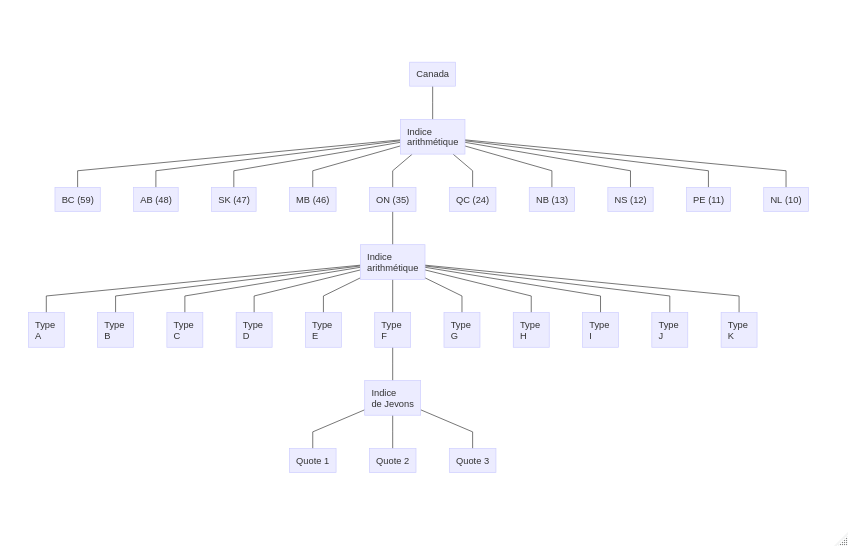

# (PART) Construire un indice des prix avec R {-}

# Programme

La mise en pratique de la théorie de l'indice des prix nécessite des outils de calcul. Un outil particulièrement utile pour construire et analyser des indices de prix est le langage de programmation R.

L'objectif de ce module est de fournir une expérience pratique de la construction et de l'analyse d'un indice des prix avec R. À la fin de ce module, une personne devrait:

1. Comprendre comment appliquer la théorie de l'indice des prix pour construire un indice des prix.
2. Savoir comparer les indices de prix de différentes sources.
3. Connaître la manière de construire et d'analyser un indice de prix avec R.

Ce module est utile pour les compilateurs d'indices de prix ayant une compréhension de base de la théorie et de la construction d'un indice de prix, et qui souhaitent mettre la théorie en pratique et acquérir une compréhension plus approfondie de R.

Ce module consiste en une tâche de grande envergure qui permet aux apprenants de construire et d'analyser un indice de prix en R sur une semaine. Le rythme du module est autogéré, mais une semaine entière devrait être consacrée à ce travail. Toutes les données pour cette affectation ont été générées au hasard.

Prérequis: une introduction aux indices de prix et une compréhension de base de la théorie de l'indice des prix R. et des indices de prix de qualité constante, ainsi qu'une compréhension intermédiaire de R, sont utiles.

L'évaluation de ce module est basée sur une tâche unique qui s'appuie sur les connaissances antérieures des apprenants sur la théorie de l'indice des prix. Le devoir se compose de 4 questions (plus une question bonus). La collaboration sur la mission est encouragée, mais chaque personne doit soumettre son propre travail unique. Les réponses à la mission, ainsi que le code de travail pour chaque question (à l'exclusion de la question bonus) valent 15%. L'instructeur doit être capable de comprendre et d'exécuter votre code; voir [example.R](scripts/example.R) pour un exemple. Chaque question correctement répondue vaut 10% supplémentaires. Répondre correctement à la question bonus vaut 20%. La réussite de ce module nécessite une note de 60% ou plus.

Veuillez envoyer un e-mail à l'instructeurs du cours ([Steve Martin](mailto:steve.martin5@canada.ca) ou [Rebecca Meier](mailto:rebecca.meier@canada.ca)) si vous avez des questions ou si vous avez besoin d'aide concernant le matériel ou le devoir du cours.

# Affectation

Les widgets sont un produit fortement réglementé dans chacune des 10 provinces, et le gouvernement fédéral limite les mouvements de widgets entre les provinces. Récemment, en réponse au tollé général suscité par le caractère inaccessible des widgets, le groupe canadien d'analyse économique réglementaire a proposé que le gouvernement fédéral autorise le commerce interprovincial de widgets pour améliorer l'accès aux marchés et réduire les prix. Avant d'envisager de concevoir une nouvelle politique, le gouvernement fédéral aimerait toutefois évaluer comment les prix des widgets ont augmenté ces dernières années. Un indice des prix est nécessaire pour les marchés de widgets provinciaux et pour le pays dans son ensemble.

Le groupe Analyse réglementaire de la réglementation canadienne produit un indice mensuel des prix à l'échelle du Canada pour les widgets (c.-à-d. Aucune ventilation provinciale), bien qu'il y ait peu d'information sur leurs sources de données ou leur méthodologie. La société privée Monsterweb, un courtier en widgets, établit également un indice des prix à l'échelle du Canada pour les widgets. Étant donné que les marchés provinciaux des widgets sont isolés les uns des autres, un indice des prix provincial est nécessaire pour évaluer comment les prix des widgets ont évolué au fil du temps et s'il est nécessaire que le gouvernement prenne des mesures politiques.

Les widgets sont de différents types, et une enquête a été utilisée pour collecter des devis mensuels pour une sélection de widgets représentatifs des types "A" à "J" de janvier 2018 à décembre 2019. Ces données sont stockées dans le système de prix globaux. Ces données d'enquête sont complétées par des données accessibles au public pour les transactions de widgets de type «K» qui n'ont pas pu être échantillonnées au cours de cette période, ainsi que la valeur des widgets traités dans chaque province en 2018 et 2019. Notez que les widgets de type «I» étaient un nouveau produit en 2019, et ces types de widgets ont remplacé les widgets de type "J" dans l'échantillon en 2019. En raison de la variation régionale des ventes de widgets, le même nombre de devis n'a pas pu être collecté pour tous les types de widgets dans toutes les provinces.

Toutes ces données sont résumées comme suit.

| Nom de fichier | Données |
| --- | --- |
| dat_gps | Offres de prix mensuelles pour les types de widget "A" à "J" de janvier 2018 à décembre 2019 à partir du système de prix globaux. |
| dat_micro | Microdonnées accessibles au public pour les transactions quotidiennes des widgets de type "K" de janvier 2018 à décembre 2019. |
| poids | Valeur de la transaction de widget (en milliers de dollars) dans chaque province pour 2018 et 2019. |
| index_crea | L'indice des prix du groupe canadien d'analyse économique réglementaire. |
| index_mw | Indice des prix de Monsterweb. |

Votre objectif est de construire un indice mensuel des prix des widgets, de janvier 2018 à décembre 2019, pour chacune des 10 provinces et le pays dans son ensemble, et de valider cet indice avec ceux produits par le Groupe canadien d'analyse économique réglementaire et Monsterweb. Vous devrez utiliser cet index pour répondre aux questions suivantes.

1. Quelle province a connu la plus forte augmentation des prix depuis le début de 2018? De combien les prix ont-ils changé?

2. Quelle province a connu la plus faible augmentation des prix depuis le début de 2018? De combien les prix ont-ils changé?

3. Quelle a été la plus importante variation des prix d'un mois à l'autre? Dans quelle province et quel mois cela s'est-il produit?

4. Tracez les trois indices au niveau du Canada sur un graphique. Quel indice montre la plus forte augmentation en pourcentage des prix des widgets nationaux depuis le premier trimestre 2019?

5. (Bonus) Calculez les coefficients de variation (CV) pour les indices provinciaux. En utilisant les règles de qualité habituelles pour la diffusion des données à Statistique Canada, quels indices provinciaux devraient être diffusés avec un avertissement (c.-à-d. Un CV supérieur à 33,3)?

## Méthodologie

Les widgets vont être stratifiés par province et par type de widget pour produire des indices élémentaires au niveau de la province par type de widget. Ces indices élémentaires doivent être calculés avec un indice de Jevons. Les indices provinciaux et canadiens vont être des indices arithmétiques qui agrègent les indices élémentaires en utilisant des pondérations de part de valeur. Les pondérations des indices arithmétiques vont être mises à jour en 2019, avec janvier 2019 comme mois de liaison. La structure d'agrégation est résumée dans le graphique ci-dessous.

```{r, eval=FALSE, echo=FALSE}
library(DiagrammeR)
mermaid('
    graph TD
        C[Canada] --- AA[Indice <br> arithmétique]
        AA --- BC["BC (59)"]
        AA --- AB["AB (48)"]
        AA --- SK["SK (47)"]
        AA --- MB["MB (46)"]
        AA --- ON["ON (35)"]
        AA --- QC["QC (24)"]
        AA --- NB["NB (13)"]
        AA --- NS["NS (12)"]
        AA --- PE["PE (11)"]
        AA --- NL["NL (10)"]
        ON --- A[Indice <br> arithmétique]
        A --- a[Type </br> A]
        A --- b[Type </br> B]
        A --- c[Type </br> C]
        A --- d[Type </br> D]
        A --- e[Type </br> E]
        A --- f[Type </br> F]
        A --- g[Type </br> G]
        A --- h[Type </br> H]
        A --- i[Type </br> I]
        A --- j[Type </br> J]
        A --- k[Type </br> K]
        f --- J[Indice <br> de Jevons]
        J --- q1[Quote 1]
        J --- q2[Quote 2]
        J --- q3[Quote 3]
')

```



## Instructions

Ces instructions décrivent un moyen simple de construire l'indice des prix des widgets, mais n'hésitez pas à utiliser une approche différente si c'est plus facile. Le but est de comprendre le processus, plutôt que de concevoir le système le plus efficace en termes de calcul. (Astuce: consultez le package [dplyr](https://cran.r-project.org/package=dplyr) package, le package [gpindex](https://cran.r-project.org/package=gpindex), et le package [calpr](https://github.com/ppd-dpp/calpr) pour quelques outils utiles.)

Exécutez le code suivant pour récupérer tous les fichiers de données et les placer dans votre environnement de travail.

```r
source ('https://raw.githubusercontent.com/ppd-dpp/cours-indices-des-prix/master/scripts/get_data.R')
```

1. **Faites les poids**

    À l'aide du fichier «poids», créez un ensemble de poids qui donne la part de valeur de chaque produit vendu dans chaque province chaque année, et un autre qui donne la part de valeur de tous les produits vendus dans chaque province chaque année. Ce premier ensemble de poids sera utilisé pour agréger les indices élémentaires pour obtenir 10 indices au niveau de la province, et le deuxième ensemble de poids sera utilisé pour agréger les indices au niveau de la province en un indice national. Il devrait y avoir 200 poids dans le premier fichier et 20 poids dans le second fichier.

2. **Calculez la géomée du produit K**

    En utilisant les microdonnées pour le produit K dans le fichier `dat_micro`, calculez la moyenne géométrique des prix dans chaque province pour chaque mois de chaque année de référence. Ce fichier devrait contenir 250 géomées.

3. **Calculez la géomée des produits A à J**

    En utilisant les données du système de prix globaux dans `dat_gps`, calculez la moyenne géométrique des prix pour chaque produit dans chaque province dans chaque mois de chaque année de référence, pour les produits A à J. Combinez ces données avec les données préparées à l'étape 2. Le fichier résultant devrait avoir 2 500 géomées.

4. **Calculer les indices élémentaires période sur période**

    Pour chaque produit dans chaque province dans chaque année de référence, calculez le rapport des moyennes géométriques calculées à l'étape 3, en vous assurant d'avoir un prix relatif de 1 en janvier 2018 et janvier 2019 (janvier 2019 sera le mois de liaison lorsqu'il est le temps de chaîner l'index.)

5. **Prix mettre à jour les poids des produits**

    Fusionnez les pondérations au niveau du produit par province de l'étape 1 dans l'ensemble de données créé à l'étape 4 et utilisez les indices élémentaires période sur période pour mettre à jour les pondérations.

6. **Calculez l'indice provincial**

    Calculez un indice arithmétique pour chaque province au cours de chaque année de référence, à l'aide des indices élémentaires d'une période à l'autre et des pondérations mises à jour des prix des étapes 4 et 5.

7. **Calculez l'indice au niveau du Canada**

    Fusionnez les pondérations provinciales à l'étape 1 avec les indices provinciaux de l'étape 6 pour calculer un indice canadien pour chaque année de référence.

8. **Chaîne des indices 2018 et 2019**

    Enchaînez les indices au niveau de la province de 2018 et 2019 et du niveau du Canada ensemble, en utilisant janvier 2019 comme mois de liaison, pour obtenir un indice de janvier 2018 à décembre 2019 avec janvier 2018 comme période de base (généralement, la période de base serait une année civile , mais il n'y a que 24 mois de données).

Le résultat final devrait être un fichier avec 11 indices de prix, un pour chaque province et un indice national, de janvier 2018 à décembre 2019, avec janvier 2018 comme période de base (= 100).

La validation de l'indice au niveau du Canada nécessite de mettre l'indice du groupe canadien d'analyse économique réglementaire et l'indice Monsterweb sous une forme commune.

9. **Trimestre par rapport aux indices mensuels**

    Transformez l'indice que vous venez de créer et l'indice du groupe Analyse réglementaire de la réglementation canadienne dans `index_crea` en un indice trimestriel, avec le 1er trimestre 2019 comme période de base, en prenant la moyenne des trois valeurs d'indice de chaque trimestre.

10. **Ajoutez les trois indices ensemble**

     Rassemblez les indices de l'étape 9 dans un ensemble de données avec l'index de Monsterweb dans `index_mw`. Ils devraient tous être trimestriels avec le premier trimestre 2019 comme période de base (= 100).
